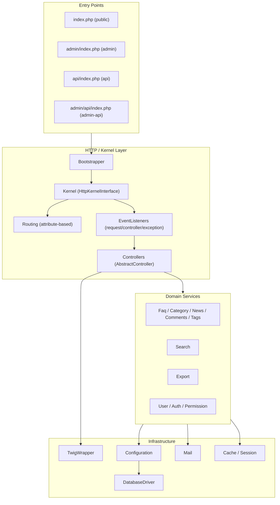
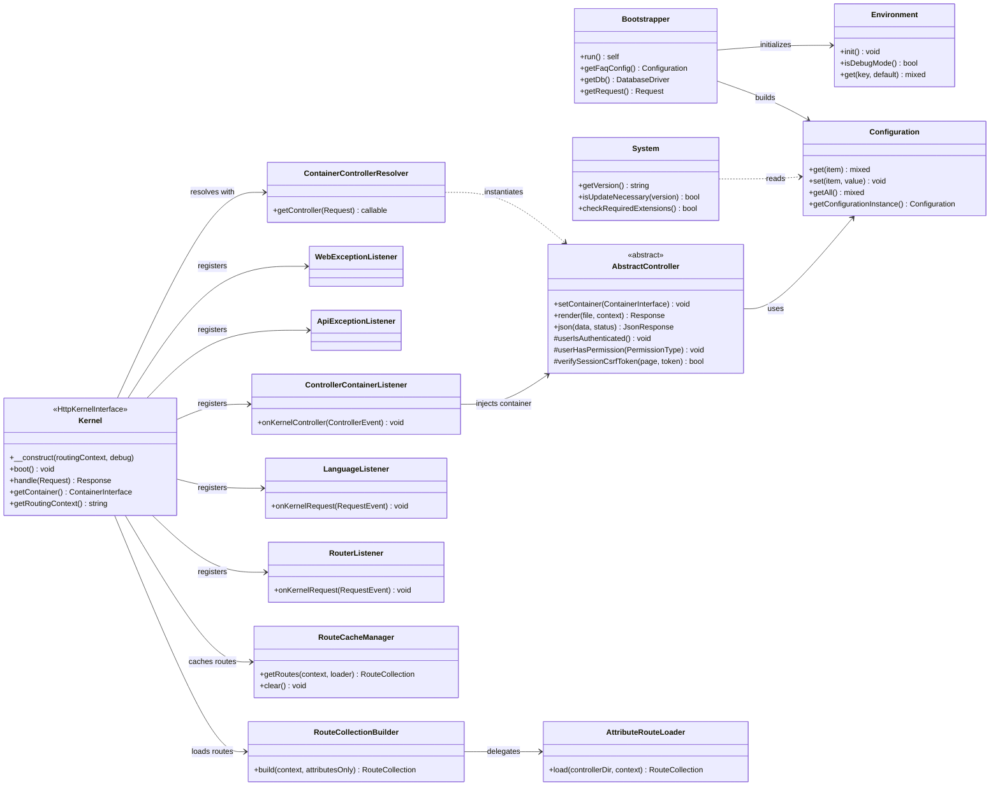
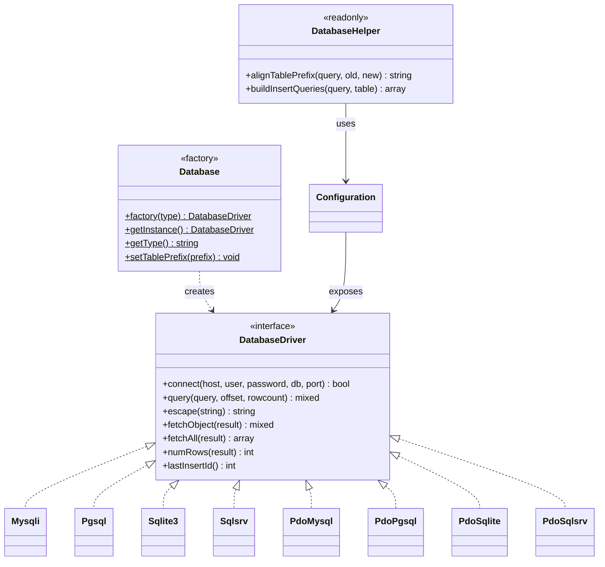
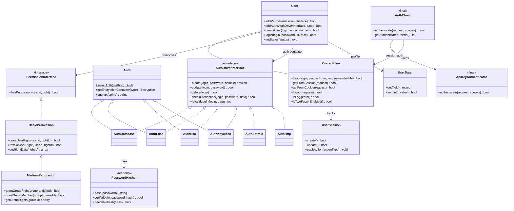
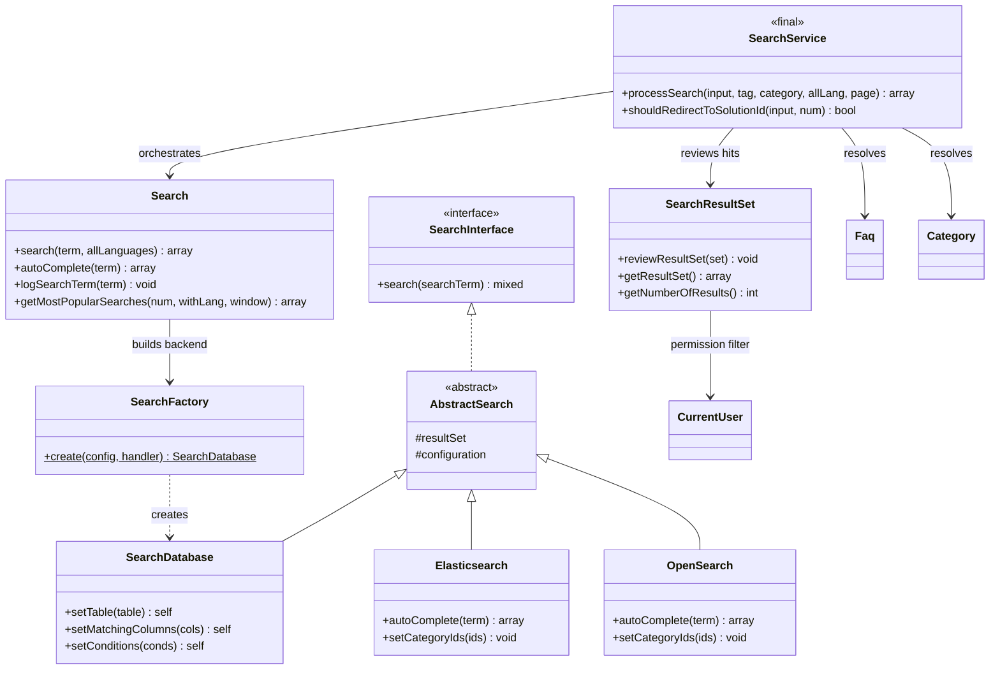
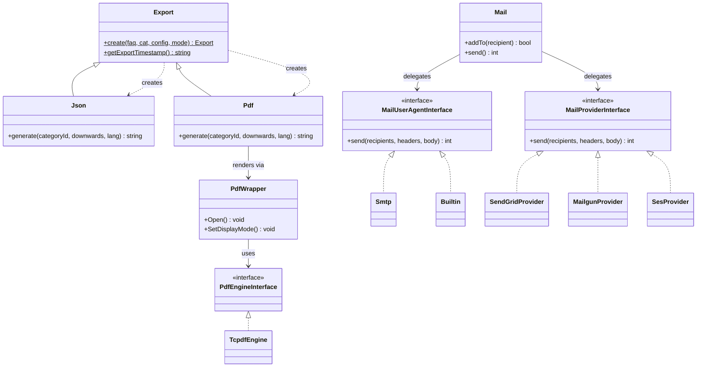

# phpMyFAQ Architecture &amp; Class Diagrams

This document describes the architecture of the phpMyFAQ PHP backend
(`phpmyfaq/src/phpMyFAQ`) and visualizes the most important classes and their
relationships as [Mermaid](https://mermaid.js.org/) class diagrams.

Because the backend contains several hundred classes, a single flat diagram
would be unreadable. Instead the system is broken into its main subsystems, and
each gets a focused diagram showing the key classes, interfaces, inheritance,
and composition relationships. Helper, repository, and value-object classes are
included only where they clarify the design.

> **Notation:** `<|..` = *implements interface*, `<|--` = *extends class*,
> `-->` = *uses / holds a reference (composition)*, `..>` = *creates (factory)*.

## Table of Contents

1. [Subsystem Overview](#1-subsystem-overview)
2. [Request Lifecycle: Bootstrap, Kernel and Routing](#2-request-lifecycle-bootstrap-kernel-and-routing)
3. [Database Abstraction Layer](#3-database-abstraction-layer)
4. [Authentication, User and Permission](#4-authentication-user-and-permission)
5. [FAQ Domain Model](#5-faq-domain-model)
6. [Search Subsystem](#6-search-subsystem)
7. [Export and Mail Subsystems](#7-export-and-mail-subsystems)
8. [Cross-Cutting Patterns](#8-cross-cutting-patterns)

---

## 1. Subsystem Overview

phpMyFAQ is a request/response web application built on **Symfony HttpKernel**,
**Symfony Routing** (via PHP 8 `#[Route]` attributes), **Twig** templates, and a
home-grown database abstraction layer that supports MySQL, PostgreSQL, SQLite,
and SQL Server. Four entry points (`index.php`, `admin/index.php`,
`api/index.php`, `admin/api/index.php`) each boot a `Kernel` configured for a
different *routing context*.

The **`Configuration`** object is the backbone of the system: nearly every
domain service receives it via constructor injection, and it in turn exposes the
active `DatabaseDriver`, the plugin manager, the logger, and grouped settings
objects (mail, search, security, LDAP, layout, URL).

---

## 2. Request Lifecycle: Bootstrap, Kernel and Routing

A request is bootstrapped, routed against attribute-defined routes, dispatched
through Symfony event listeners, and resolved to a controller that is fetched —
fully dependency-injected — from the DI container.

**Flow:** `index.php` → `Bootstrapper::run()` → `Kernel::boot()` (builds the
container from `services.php`, loads routes from cache or attributes) →
`Kernel::handle()` dispatches Symfony kernel events:

1. `LanguageListener` (priority 300) initializes i18n.
2. `RouterListener` (priority 256) matches the URL to a route.
3. `ApiRateLimiterListener` (API contexts only) enforces rate limits.
4. `ControllerContainerListener` injects the shared container into the
   `AbstractController` and enforces admin authentication by default.
5. `ContainerControllerResolver` returns the pre-wired controller instance.
6. On error, `ApiExceptionListener` (RFC 7807 JSON) or `WebExceptionListener`
   (HTML error pages) produces the response.

---

## 3. Database Abstraction Layer

All persistence goes through the `DatabaseDriver` interface. A static `Database`
factory instantiates the configured driver; native and PDO-based
implementations exist for every supported engine.

> Native `Mysqli` and `Pgsql` drivers are deprecated in favor of the PDO
> variants and scheduled for removal in a future major release.

---

## 4. Authentication, User and Permission

Authentication uses the **strategy pattern**: `Auth::selectAuth()` returns a
driver implementing `AuthDriverInterface`. A `User` composes one or more auth
drivers plus a `PermissionInterface` strategy. `CurrentUser` extends `User` with
session/cookie handling, login throttling, and 2FA. For API requests, `AuthChain`
tries session → API key → OAuth2 in turn.

`PermissionInterface` has two implementations: `BasicPermission` (per-user
rights) and `MediumPermission` (adds group rights and group membership). Both are
backed by readonly repository classes (`BasicPermissionRepository`,
`MediumPermissionRepository`, `GroupCategoryPermissionRepository`).

---

## 5. FAQ Domain Model

The domain layer is **service-oriented**: each aggregate (`Faq`, `Category`,
`News`, …) is a service that operates on plain *entity* value objects from the
`Entity\` namespace and persists through dedicated repositories. The `Faq`
service is the hub, collaborating with the other content services.

```mermaid
classDiagram
    direction TB

    class Faq {
        +getFaq(id, revisionId, admin) void
        +getAllAvailableFaqsByCategoryId(id, ...) array
        +create(FaqEntity) FaqEntity
        +update(FaqEntity) FaqEntity
        +delete(id, lang) bool
    }
    class Category {
        +getOrderedCategories(...) array
        +getCategoryData(id) CategoryEntity
        +buildCategoryTree(id, depth) void
        +getPath(id) array
    }
    class News {
        <<readonly>>
        +getAll(...) array
        +create(NewsMessage) int
        +update(NewsMessage) bool
    }
    class Comments {
        +getCommentsData(id, type) Comment[]
        +create(Comment) bool
        +delete(type, id) bool
    }
    class Tags {
        +getAllTagsById(id) array
        +create(id, tags) bool
        +getPopularTags(limit) array
    }
    class Rating {
        <<readonly>>
        +get(id) string
        +create(Vote) bool
    }
    class Visits {
        <<readonly>>
        +logViews(id) void
        +add(id) bool
    }
    class Question {
        <<readonly>>
        +add(QuestionEntity) bool
        +getAll(...) QuestionEntity[]
    }
    class Glossary {
        +insertItemsIntoContent(content) string
        +fetchAll() array
    }
    class Bookmark {
        +add(faqId) bool
        +getAll() array
        +remove(faqId) bool
    }

    class FaqEntity {
        <<entity>>
        +id : int
        +language : string
        +solutionId : int
        +question : string
        +answer : string
    }
    class CategoryEntity {
        <<entity>>
        +id : int
        +parentId : int
        +name : string
    }
    class Comment {
        <<entity>>
        +id : int
        +type : string
        +comment : string
    }
    class NewsMessage {
        <<entity>>
    }
    class QuestionEntity {
        <<entity>>
    }
    class Vote {
        <<entity>>
    }
    class Tag {
        <<entity>>
    }

    class PermissionType {
        <<enum>>
    }
    class CommentType {
        <<enum>>
    }
    class SeoType {
        <<enum>>
    }

    Faq --> FaqEntity : reads/writes
    Faq --> Category : category data
    Faq --> Comments : related
    Faq --> Tags : related
    Faq --> Rating : related
    Faq --> Visits : related
    Faq --> Glossary : enriches
    Category --> CategoryEntity : reads/writes
    Comments --> Comment : reads/writes
    Comments --> CommentType : typed by
    News --> NewsMessage : reads/writes
    Question --> QuestionEntity : reads/writes
    Rating --> Vote : reads/writes
    Tags --> Tag : reads/writes
    Bookmark --> CurrentUser : owner

    Faq ..> Configuration : injected
    Category ..> Configuration : injected
    News ..> Configuration : injected
```

All services receive `Configuration` via the constructor (omitted from most
arrows above for clarity). Entities are fluent data containers; enums such as
`PermissionType`, `AdminLogType`, `SeoType`, and `CommentType` model fixed sets
to keep illegal states unrepresentable.

---

## 6. Search Subsystem

Search follows the **strategy + factory** pattern. The high-level `Search`
service routes to a database, Elasticsearch, or OpenSearch backend depending on
configuration; all three implement `SearchInterface` via `AbstractSearch`.
`SearchResultSet` post-processes hits, applying permission filtering.

---

## 7. Export and Mail Subsystems

**Export** uses a static factory on the abstract `Export` base to produce a
`Pdf` or `Json` exporter. **Mail** separates two extension points: low-level
*user agents* (`MailUserAgentInterface`: SMTP, PHP `mail()`) and high-level
*providers* (`MailProviderInterface`: SendGrid, Mailgun, AWS SES).

The **Setup/Migration** subsystem (not diagrammed here) follows the same
philosophy: a `MigrationInterface` / `AbstractMigration` hierarchy records
`OperationInterface` steps (SQL, config, file, permission operations) into an
`OperationRecorder`, executed or dry-run by `MigrationExecutor` against a
database-specific `DialectInterface` produced by `DialectFactory`.

---

## 8. Cross-Cutting Patterns

The codebase consistently applies a small set of design patterns. Recognizing
them makes the rest of the system predictable:

| Pattern | Where | Purpose |
| --- | --- | --- |
| **Factory** | `Database::factory()`, `Auth::selectAuth()`, `Export::create()`, `SearchFactory`, `DialectFactory` | Pick a concrete implementation from configuration |
| **Strategy** | `DatabaseDriver`, `AuthDriverInterface`, `PermissionInterface`, `SearchInterface`, `MailUserAgentInterface` | Swap behavior behind a stable interface |
| **Repository** | `*Repository` classes per domain service | Isolate SQL from business logic |
| **Entity / Value Object** | `Entity\*` | Typed, fluent data containers |
| **Chain of Responsibility** | `AuthChain` (session → API key → OAuth2) | Try multiple authenticators in order |
| **Event Listener** | `*Listener` on Symfony kernel events | Cross-cutting request/exception handling |
| **Dependency Injection** | `services.php` + Symfony container | Constructor-wire all services and controllers |
| **Builder / Fluent** | `SearchDatabase`, `QueryBuilder`, entity setters | Stepwise, readable construction |
| **Enum for fixed sets** | `Enums\*` (`PermissionType`, `SeoType`, …) | Make illegal states unrepresentable |

### Where to look in the code

| Concern | Path |
| --- | --- |
| Bootstrap &amp; kernel | `phpmyfaq/src/phpMyFAQ/Bootstrapper.php`, `Kernel.php`, `Bootstrap/` |
| Routing | `phpmyfaq/src/phpMyFAQ/Routing/`, controller `#[Route]` attributes |
| Controllers | `phpmyfaq/src/phpMyFAQ/Controller/` |
| DI configuration | `phpmyfaq/src/services.php` |
| Database | `phpmyfaq/src/phpMyFAQ/Database/` |
| Auth / User / Permission | `phpmyfaq/src/phpMyFAQ/Auth/`, `User/`, `Permission/` |
| Domain services | `phpmyfaq/src/phpMyFAQ/Faq.php`, `Category.php`, `News.php`, … |
| Entities &amp; enums | `phpmyfaq/src/phpMyFAQ/Entity/`, `Enums/` |
| Search | `phpmyfaq/src/phpMyFAQ/Search/` |
| Export / Mail | `phpmyfaq/src/phpMyFAQ/Export/`, `Mail/` |
| Templating | `phpmyfaq/src/phpMyFAQ/Twig/`, `Template/` |

---

*Generated from static analysis of the `phpmyfaq/src/phpMyFAQ` source tree.*
*Diagrams render automatically on GitHub and in any Mermaid-aware Markdown viewer.*
